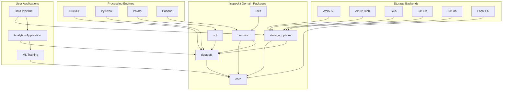
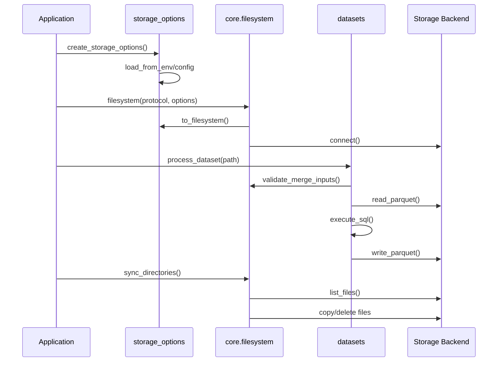
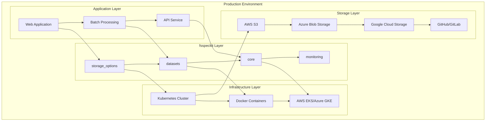

# Architecture Overview

`fsspeckit` extends `fsspec` with a comprehensive, production-ready framework for interacting with various filesystems and data formats. This document provides a complete technical reference for understanding the system's design, implementation patterns, and operational considerations.

## Executive Overview

### Purpose and Value Proposition

`fsspeckit` provides enterprise-grade data processing capabilities through a modular, domain-driven architecture that balances performance, consistency, and extensibility. The system enables users to work with multiple storage backends, data formats, and processing engines through unified APIs while maintaining the flexibility to customize behavior for specific use cases.

### Core Architectural Principles

1. **Domain-Driven Design**: Clear separation of concerns through domain-specific packages
2. **Backend Neutrality**: Consistent interfaces across different storage providers and processing engines
3. **Performance First**: Intelligent caching, parallel processing, and optimization strategies
4. **Production Ready**: Comprehensive error handling, monitoring, and operational excellence
5. **Extensible Architecture**: Plugin-style design for adding new capabilities
6. **Backwards Compatibility**: Gradual migration path for existing users

### Target Use Cases

- **Multi-Cloud Data Processing**: Unified access to AWS S3, Azure Blob, Google Cloud Storage
- **Large-Scale Analytics**: High-performance dataset operations with DuckDB and PyArrow
- **Enterprise Integration**: Git-based workflows with GitHub and GitLab
- **Real-Time Processing**: Stream processing and analytics with monitoring
- **Data Pipeline Orchestration**: Complex cross-domain workflows with error resilience

## Architectural Decision Records (ADRs)

### ADR-001: Domain Package Architecture

**Decision**: Organize fsspeckit into domain-specific packages (core, storage_options, datasets, sql, common, utils) rather than a monolithic structure.

**Rationale**:
- **Separation of Concerns**: Each domain has distinct responsibilities and user patterns
- **Discoverability**: Users can easily find relevant functionality without searching large modules
- **Testing**: Isolated testing for each domain with clear boundaries
- **Maintenance**: Changes to one domain don't impact others
- **Team Collaboration**: Different teams can work on different domains independently

**Alternatives Considered**:
- Monolithic package: Easier initial development but harder to maintain
- Feature-based packages: Better for features but worse for user discoverability
- Layered architecture: Good for dependency management but less intuitive for users

**Migration Path**: Existing imports through `fsspeckit.utils` continue working while new code uses domain-specific imports.

### ADR-002: Backend-Neutral Planning Layer

**Decision**: Centralize merge and maintenance planning logic in the core package with backend-specific delegates.

**Rationale**:
- **Consistency**: All backends use identical merge semantics and validation
- **Maintainability**: Single source of truth for business logic
- **Performance**: Shared optimization strategies across implementations
- **Testing**: Consistent behavior validation across all backends

**Implementation**: Both DuckDB and PyArrow backends delegate to `core.merge` and `core.maintenance` for planning, validation, and statistics calculation.

### ADR-003: Façade Pattern for Backwards Compatibility

**Decision**: Maintain `fsspeckit.utils` as a backwards-compatible façade that re-exports selected helpers from domain packages.

**Rationale**:
- **Gradual Migration**: Existing code continues working without immediate changes
- **User Experience**: Clear migration path with deprecation warnings
- **API Stability**: Existing import patterns remain functional
- **Documentation**: Gradual transition with clear guidance

**Trade-offs**: Additional maintenance overhead for the façade layer, but justified by user experience benefits.

### ADR-004: Multi-Cloud Abstraction Strategy

**Decision**: Implement protocol-agnostic storage configuration with automatic inference and environment-based setup.

**Rationale**:
- **Portability**: Code works across different cloud providers without changes
- **Configuration**: Environment-based configuration for production deployments
- **Flexibility**: Users can override defaults for specific requirements
- **Testing**: Easy switching between providers for testing scenarios

**Implementation Pattern**:
```python
# Protocol-agnostic approach
fs = filesystem("s3", storage_options=aws_options)
fs = filesystem("gs", storage_options=gcs_options)
fs = filesystem("az", storage_options=azure_options)

# URI-based inference
fs = filesystem("s3://bucket/path")  # Auto-detects protocol
```

### ADR-005: Intelligent Caching Architecture

**Decision**: Implement directory structure preserving caching with monitoring capabilities.

**Rationale**:
- **Performance**: Reduces redundant network calls
- **Structure Preservation**: Maintains original file organization in cache
- **Observability**: Monitored operations with detailed logging
- **Configurability**: Users can control cache behavior and location

**Implementation**: `FileNameCacheMapper` and `MonitoredSimpleCacheFileSystem` provide enhanced caching with directory structure preservation and comprehensive monitoring.

## Core Architecture Deep Dive

### Domain Package Breakdown

#### `fsspeckit.core` - Foundation Layer

The core package provides fundamental filesystem APIs and backend-neutral planning logic:

**Key Components:**

- **`AbstractFileSystem`** (`core/ext.py`): Extended base class with enhanced functionality
  ```python
  class AbstractFileSystem(fsspec.AbstractFileSystem):
      """Enhanced filesystem with smart path handling and protocol inference."""
  ```

- **`MonitoredSimpleCacheFileSystem`**: Production-ready caching layer
  ```python
  class MonitoredSimpleCacheFileSystem(SimpleCacheFileSystem):
      """Caching with directory structure preservation and monitoring."""
  ```

- **`GitLabFileSystem`**: Custom GitLab integration
  ```python
  class GitLabFileSystem(AbstractFileSystem):
      """Filesystem interface for GitLab repositories with token auth."""
  ```

- **`FileNameCacheMapper`**: Intelligent cache path management
  ```python
  class FileNameCacheMapper:
      """Maps remote paths to local cache while preserving directory structure."""
  ```

**Integration Patterns:**
- Protocol detection and inference from URIs
- Smart path normalization and validation
- Unified authentication across different backends

#### `fsspeckit.storage_options` - Configuration Layer

Manages storage configurations for cloud and Git providers:

**Factory Pattern Implementation:**
```python
def from_dict(protocol: str, storage_options: dict) -> BaseStorageOptions
def from_env(protocol: str) -> BaseStorageOptions
def storage_options_from_uri(uri: str) -> BaseStorageOptions
```

**Provider Implementations:**
- **`AwsStorageOptions`**: Complete AWS S3 configuration
- **`GcsStorageOptions`**: Google Cloud Storage setup
- **`AzureStorageOptions`**: Azure Blob Storage configuration
- **`GitHubStorageOptions`**: GitHub repository access
- **`GitLabStorageOptions`**: GitLab repository configuration

**Key Features:**
- YAML serialization for persistent configuration
- Environment variable auto-configuration
- Protocol inference from URIs
- Unified interface across all providers

#### `fsspeckit.datasets` - Data Processing Layer

High-performance dataset operations for large-scale data processing:

**DuckDB Implementation:**
```python
class DuckDBParquetHandler:
    """High-performance parquet operations with atomic guarantees."""

    def __init__(self, storage_options=None):
        self.storage_options = storage_options
        self.connection = None

    def write_parquet_dataset(self, table, path, **kwargs):
        """Atomic dataset writing with backup-and-restore."""

    def execute_sql(self, query, **kwargs):
        """Parameterized SQL execution with fsspec integration."""
```

**PyArrow Implementation:**
```python
# Optimization and compaction functions
def optimize_parquet_dataset_pyarrow(dataset_path, **kwargs):
    """Z-ordering and file size optimization."""

def compact_parquet_dataset_pyarrow(dataset_path, **kwargs):
    """Dataset compaction with atomic operations."""
```

**Backend Integration:**
- Shared merge logic from `core.merge`
- Common maintenance operations from `core.maintenance`
- Consistent statistics and validation across backends

#### `fsspeckit.sql` - Query Translation Layer

SQL-to-filter translation for cross-framework compatibility:

**Core Functions:**
```python
def sql2pyarrow_filter(string: str, schema: pa.Schema) -> pc.Expression:
    """Convert SQL WHERE clause to PyArrow filter expression."""

def sql2polars_filter(string: str, schema: pl.Schema) -> pl.Expr:
    """Convert SQL WHERE clause to Polars filter expression."""
```

**Integration Points:**
- Cross-framework SQL expression translation
- Schema-aware filter generation
- Unified SQL parsing using sqlglot
- Table name extraction for validation

#### `fsspeckit.common` - Shared Utilities Layer

Cross-cutting utilities used across all domains:

**Parallel Processing:**
```python
def run_parallel(
    func: Callable,
    data: Sequence[Any],
    max_workers: Optional[int] = None,
    progress: bool = True
) -> List[Any]:
    """Parallel execution with progress tracking and error handling."""
```

**Type Conversion:**
```python
def dict_to_dataframe(data: Dict[str, Any], library: str = "polars"):
    """Convert dictionaries to Polars/Pandas DataFrames."""

def to_pyarrow_table(data: Any) -> pa.Table:
    """Convert various data types to PyArrow tables."""
```

**File Operations:**
```python
def sync_dir(src_fs, dst_fs, src_path: str, dst_path: str, **kwargs):
    """Synchronize directories between filesystems."""

def extract_partitions(path: str, **kwargs) -> Dict[str, str]:
    """Extract partition information from file paths."""
```

#### `fsspeckit.utils` - Backwards Compatibility Façade

Re-exports selected helpers from domain packages for backwards compatibility:

```python
# Re-exports for backwards compatibility
from ..common.misc import run_parallel
from ..common.datetime import timestamp_from_string
from ..common.types import dict_to_dataframe, to_pyarrow_table
```

**Migration Strategy:**
- Immediate compatibility with existing code
- Gradual migration to domain-specific imports
- Deprecation warnings for discouraged patterns

## Integration Patterns

### Cross-Domain Communication

**Import Patterns:**
```python
# Core → Storage Options
from fsspeckit.storage_options.base import BaseStorageOptions

# Datasets → Core Merge Logic
from fsspeckit.core.merge import (
    MergeStrategy, validate_merge_inputs,
    calculate_merge_stats, check_null_keys
)

# Storage Options → Core Filesystem
from fsspeckit.core.filesystem import filesystem
```

**Configuration Flow:**
```python
# YAML-based configuration
options = BaseStorageOptions.from_yaml("config.yml")
fs = options.to_filesystem()

# Environment-based configuration
options = StorageOptions.from_env("s3")
fs = options.to_filesystem()

# Programmatic configuration
options = StorageOptions.create(protocol="s3", region="us-east-1")
```

### Error Handling Architecture

**Consistent Exception Types:**
- `ValueError` for configuration and validation errors
- `FileNotFoundError` for missing resources
- `PermissionError` for access control issues
- Custom exceptions for domain-specific errors

**Context-Aware Error Messages:**
```python
try:
    result = operation()
except ValueError as e:
    logger.error(f"Operation failed: {e}", extra={
        "operation": "data_processing",
        "context": context_dict,
        "error_code": "VALIDATION_ERROR"
    })
```

**Graceful Degradation:**
- Optional dependencies with fallback implementations
- Feature detection with appropriate warnings
- Progressive enhancement patterns

### Data Flow Patterns

**Typical Data Processing Pipeline:**
```python
# 1. Configuration Setup
storage_options = AwsStorageOptions.from_env("s3")
fs = filesystem("s3", storage_options=storage_options.to_dict())

# 2. Data Processing
with DuckDBParquetHandler(storage_options=storage_options.to_dict()) as handler:
    # Data ingestion
    handler.write_parquet_dataset(data, "s3://bucket/raw/")

    # Processing
    result = handler.execute_sql("""
        SELECT region, SUM(amount) as total
        FROM parquet_scan('s3://bucket/raw/')
        GROUP BY region
    """)

    # Output
    handler.write_parquet_dataset(result, "s3://bucket/processed/")
```

**Cross-Storage Operations:**
```python
# Sync between cloud providers
src_fs = filesystem("s3", storage_options=s3_options)
dst_fs = filesystem("az", storage_options=azure_options)

sync_dir(
    src_fs, dst_fs,
    "s3://bucket/data/",
    "az://container/data/",
    progress=True
)
```

## Performance and Scalability Architecture

### Caching Strategy

**Multi-Level Caching:**
1. **Filesystem Level**: `MonitoredSimpleCacheFileSystem` with directory preservation
2. **Application Level**: Optional in-memory caching for frequently accessed data
3. **Network Level**: HTTP caching headers and connection pooling

**Cache Configuration:**
```python
# Custom cache configuration
cache_mapper = FileNameCacheMapper(
    cache_root="/tmp/fsspeckit_cache",
    preserve_structure=True,
    max_size_gb=10
)

fs = MonitoredSimpleCacheFileSystem(
    target_protocol="s3",
    cache_mapper=cache_mapper,
    **storage_options
)
```

### Parallel Processing Architecture

**Worker Pool Management:**
```python
def run_parallel(
    func: Callable,
    data: Sequence[Any],
    max_workers: Optional[int] = None,
    progress: bool = True,
    chunk_size: Optional[int] = None
) -> List[Any]:
    """Parallel execution with automatic resource management."""
```

**Resource Optimization:**
- Automatic worker count detection based on CPU cores
- Memory-aware chunking for large datasets
- Progress tracking and cancellation support

### Memory Management

**Efficient Data Processing:**
- Streaming operations for large files
- Chunked processing with configurable batch sizes
- Automatic memory pressure detection and response

**Type Optimization:**
```python
# Automatic type optimization in datasets
def optimize_dtypes(table: pa.Table) -> pa.Table:
    """Downcast numeric types to reduce memory usage."""
```

## Production Deployment Architecture

### Multi-Cloud Deployment

**Provider-Agnostic Configuration:**
```python
# Environment-based provider selection
def get_filesystem():
    provider = os.getenv("STORAGE_PROVIDER", "s3")
    options = StorageOptions.from_env(provider)
    return filesystem(provider, storage_options=options.to_dict())
```

**High Availability Patterns:**
- Multi-region data replication
- Automatic failover between providers
- Circuit breaker patterns for resilience

### Monitoring and Observability

**Structured Logging:**
```python
import structlog

logger = structlog.get_logger()

# Context-rich logging
logger.info("Data processing completed", extra={
    "records_processed": len(data),
    "processing_time_seconds": duration,
    "memory_usage_mb": memory_usage,
    "operation": "dataset_processing"
})
```

**Performance Monitoring:**
```python
# Built-in performance tracking
class PerformanceTracker:
    def track_operation(self, operation_name: str):
        """Context manager for operation timing."""

    def get_metrics(self) -> Dict[str, Any]:
        """Get performance metrics and statistics."""
```

### Security Architecture

**Authentication Patterns:**
```python
# Token-based authentication for Git platforms
git_options = GitHubStorageOptions(
    token=os.getenv("GITHUB_TOKEN"),
    default_branch="main"
)

# IAM-based authentication for cloud providers
aws_options = AwsStorageOptions(
    region="us-east-1",
    assume_role_arn=os.getenv("ASSUME_ROLE_ARN")
)
```

**Data Protection:**
- Encryption in transit (TLS/SSL)
- Optional client-side encryption
- Access logging and audit trails
- Credential management best practices

## Enhanced Visual Architecture

### Component Interaction Diagram



### Data Flow Architecture



### Deployment Architecture



## Extension Points and Customization

### Adding New Storage Providers

**Custom Storage Options:**
```python
class CustomStorageOptions(BaseStorageOptions):
    """Custom storage provider configuration."""

    provider: str = "custom"
    custom_endpoint: Optional[str] = None
    custom_auth: Optional[str] = None

    def to_filesystem(self) -> AbstractFileSystem:
        """Create filesystem instance."""
        return CustomFileSystem(
            endpoint=self.custom_endpoint,
            auth_token=self.custom_auth,
            **self.get_storage_options()
        )
```

**Custom Filesystem Implementation:**
```python
class CustomFileSystem(AbstractFileSystem):
    """Custom filesystem implementation."""

    def __init__(self, endpoint: str, auth_token: str, **kwargs):
        super().__init__(**kwargs)
        self.endpoint = endpoint
        self.auth_token = auth_token

    # Implement required filesystem methods
    def _open(self, path, mode="rb", **kwargs):
        """Open file for reading/writing."""
        pass
```

### Custom Processing Backends

**Extending Dataset Operations:**
```python
class CustomDatasetHandler:
    """Custom dataset processing backend."""

    def __init__(self, storage_options=None):
        self.storage_options = storage_options

    def write_dataset(self, data, path, **kwargs):
        """Custom dataset writing logic."""
        pass

    def read_dataset(self, path, **kwargs):
        """Custom dataset reading logic."""
        pass
```

### Plugin Architecture

**Plugin Registration:**
```python
# Plugin discovery and registration
def register_plugin(name: str, plugin_class: Type):
    """Register a custom plugin."""
    PLUGIN_REGISTRY[name] = plugin_class

# Usage
register_plugin("custom_storage", CustomStorageOptions)
```

## Operational Excellence

### Error Recovery Strategies

**Retry with Exponential Backoff:**
```python
from fsspeckit.common import retry_with_backoff

@retry_with_backoff(max_retries=3, base_delay=1.0)
def resilient_operation():
    """Operation with automatic retry."""
    return potentially_failing_operation()
```

**Circuit Breaker Pattern:**
```python
class CircuitBreaker:
    """Prevents cascade failures in distributed systems."""

    def __init__(self, failure_threshold: int = 5):
        self.failure_threshold = failure_threshold
        self.failure_count = 0
        self.state = "CLOSED"
```

### Health Checking

**Component Health Monitoring:**
```python
def check_system_health() -> Dict[str, bool]:
    """Check health of all system components."""
    return {
        "storage_backends": check_storage_connectivity(),
        "processing_engines": check_engine_health(),
        "memory_usage": check_memory_pressure(),
        "cache_status": check_cache_health()
    }
```

## Migration Guide

### From fsspec-utils to fsspeckit

**Step 1: Update Imports**
```python
# Old imports (still work via utils façade)
from fsspec_utils import run_parallel

# New recommended imports
from fsspeckit.common import run_parallel
```

**Step 2: Update Configuration**
```python
# Old configuration style
storage_options = {"key": "value", "secret": "secret"}

# New configuration style
from fsspeckit.storage_options import AwsStorageOptions
storage_options = AwsStorageOptions(
    access_key="key",
    secret_key="secret"
)
```

**Step 3: Update Filesystem Creation**
```python
# Old method
fs = fsspec.filesystem("s3", **storage_options)

# New method
from fsspeckit.core import filesystem
fs = filesystem("s3", storage_options=storage_options.to_dict())
```

## Conclusion

The fsspeckit architecture provides a comprehensive, production-ready foundation for data processing across multiple storage backends and processing engines. The domain-driven design ensures clear separation of concerns while maintaining consistent interfaces and behavior across all components.

The modular architecture enables easy extension and customization while maintaining backwards compatibility for existing users. Built-in performance optimizations, monitoring capabilities, and operational excellence features make fsspeckit suitable for enterprise-scale deployments.

For specific implementation details and code examples, refer to the individual domain package documentation and the comprehensive examples repository.