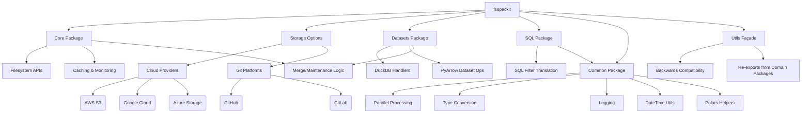

# Architecture Overview

`fsspeckit` is designed to extend and enhance the capabilities of `fsspec`, providing a robust and flexible framework for interacting with various filesystems and data formats. Its architecture is modular, built around core components that abstract away complexities and offer specialized functionalities.

## Extending `fsspec`

At its core, `fsspeckit` builds upon the `fsspec` (Filesystem Spec) library, which provides a unified Pythonic interface to various storage backends. `fsspeckit` extends this functionality by:

- **Simplifying Storage Configuration**: It offers `StorageOptions` classes for various cloud providers (AWS S3, Google Cloud Storage, Azure Storage) and Git platforms (GitHub, GitLab), allowing for easier and more consistent configuration of filesystem access.
- **Enhancing I/O Operations**: It provides extended read/write capabilities for common data formats like JSON, CSV, and Parquet, with integrations for high-performance libraries like Polars and PyArrow.
- **Improving Caching**: The library includes an enhanced caching mechanism that preserves directory structures and offers better monitoring.

## Domain Package Architecture

The `fsspeckit` library is organized into domain-specific packages that provide clear boundaries and improved discoverability:

### `fsspeckit.core`

Contains the fundamental filesystem APIs and backend-neutral planning logic:
- `filesystem()` - Central factory for creating fsspec-compatible filesystem objects
- `DirFileSystem` - Specialized handling for directory-based filesystems
- `MonitoredSimpleCacheFileSystem` - Enhanced caching with monitoring
- `GitLabFileSystem` - GitLab repository access
- Backend-neutral merge and maintenance planning in `core.merge` and `core.maintenance`

### `fsspeckit.storage_options`

Manages storage configurations for cloud and Git providers:
- `AwsStorageOptions` - AWS S3 configuration
- `GcsStorageOptions` - Google Cloud Storage configuration
- `AzureStorageOptions` - Azure Storage configuration
- `GitHubStorageOptions` - GitHub repository access
- `GitLabStorageOptions` - GitLab repository access
- Utility functions for protocol inference and option merging

### `fsspeckit.datasets`

Dataset-level operations for large-scale data processing:
- `DuckDBParquetHandler` - High-performance DuckDB parquet operations
- PyArrow dataset helpers for merge, compaction, and optimization
- Schema management and type conversion utilities
- Backend-neutral planning delegates to core modules

### `fsspeckit.sql`

SQL-to-filter translation helpers for data filtering:
- `sql2pyarrow_filter` - Convert SQL to PyArrow filter expressions
- `sql2polars_filter` - Convert SQL to Polars filter expressions
- SQL parsing and table name extraction utilities

### `fsspeckit.common`

Cross-cutting utilities shared across all domains:
- **Logging**: `setup_logging()`, `get_logger()` for consistent logging
- **Parallel Processing**: `run_parallel()` for concurrent operations
- **Type Conversion**: `dict_to_dataframe()`, `to_pyarrow_table()` for data manipulation
- **DateTime Utilities**: Timestamp parsing and timezone handling
- **Polars Helpers**: DataFrame optimization and manipulation utilities

### `fsspeckit.utils`

Backwards-compatible façade that re-exports selected helpers from domain packages. This module ensures existing code continues to work while new code should import directly from the appropriate domain packages.

## Diagrams

<!-- Placeholder for architecture diagrams. These can be generated using MkDocs's diagram features (e.g., Mermaid, PlantUML) to visualize the component interactions and data flow. -->

